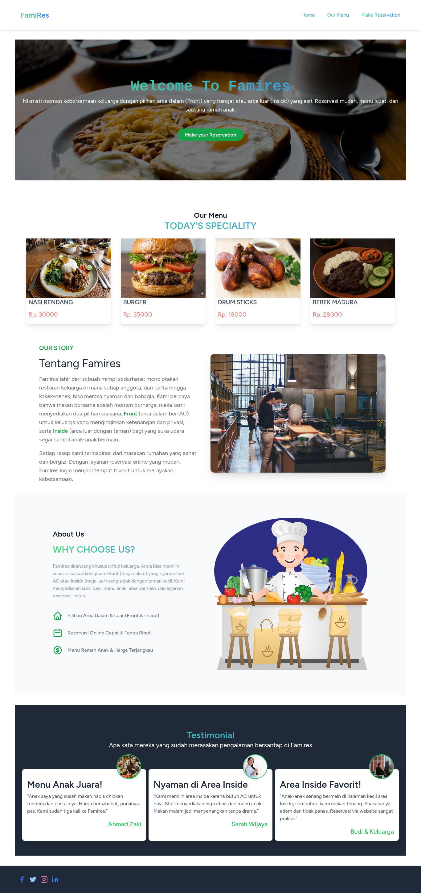
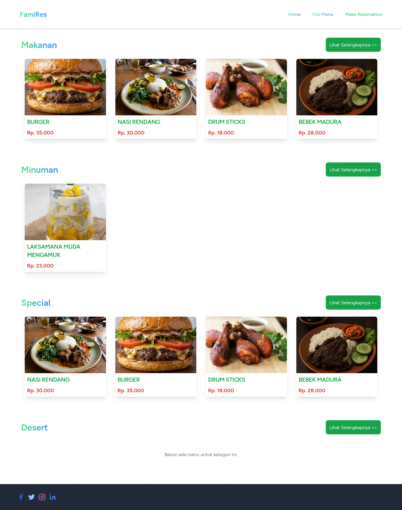
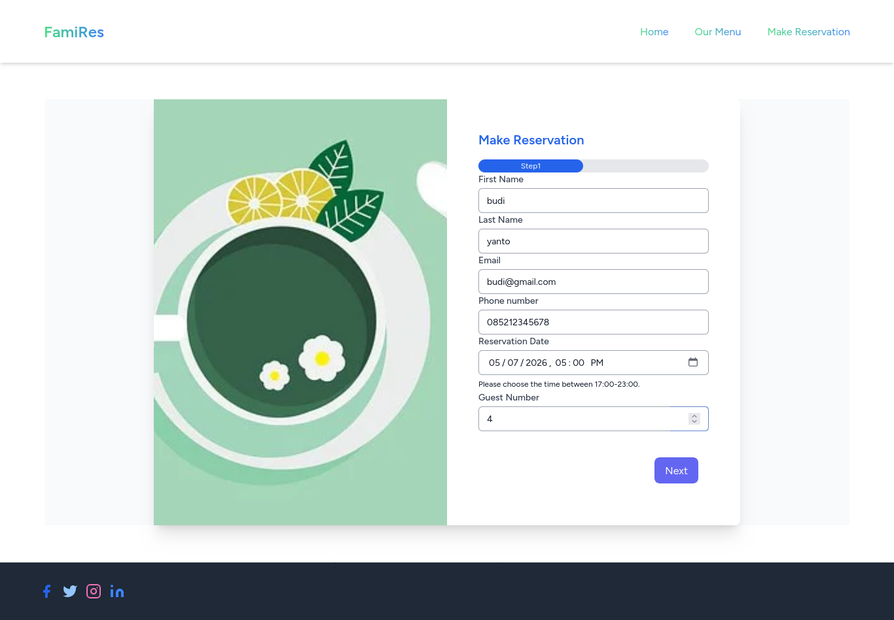
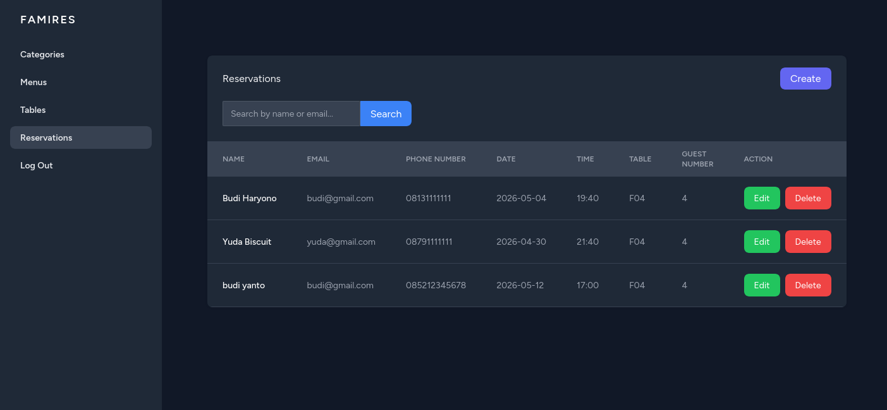

# Family Restaurant Reservation (Famires)


## 📋 Deskripsi

**Famires** adalah Website reservasi meja dan penampil menu untuk restoran keluarga. Dibangun dengan Laravel 10, MySQL 8, Tailwind CSS, dan template Blade.


### ✨ Fitur Utama

  - Reservasi Meja – Pelanggan dapat memilih meja dan melakukan pemesanan secara online
  - Variasi Menu – Menampilkan daftar makanan dan minuman lengkap dengan kategori
  - Autentikasi Pengguna – Login dan registrasi menggunakan sistem otentikasi Laravel (Blade) bawaan.

##  🛠️ Tech Stack
  - Backend: Laravel 10.x
  - Frontend: TailwindCSS 3.x
  - JavaScript: AlpineJS 3.x
  - Database: MySQL
  - Authentication: Laravel Blade

## 🖼️ Screenshots

### Homepage


### Menus



### Reservation



### Admin Reservation



---

##  Tech Stack

- **Backend**: Laravel 10.x
- **Frontend**: Blade Templates + TailwindCSS
- **Database**: MySQL/MariaDB
- **Authentication**: Laravel Breeze
- **PHP**: 8.1+
- **Package Manager**: Composer, NPM

### Langkah Instalasi

#### 1. Clone Repository
```bash
git clone https://github.com/AnggitSeptiansyah/restaurant_reservation.git
cd restaurant_reservation
```

#### 2. Install Dependencies
```bash
# Install PHP dependencies
composer install

# Install JavaScript dependencies
npm install
```

#### 3. Environment Setup
```bash
# Copy file .env
cp .env.example .env

# Generate application key
php artisan key:generate
```

#### 4. Konfigurasi Database

Edit file `.env`:
```env
DB_CONNECTION=mysql
DB_HOST=127.0.0.1
DB_PORT=3306
DB_DATABASE=restaurant_reservation
DB_USERNAME=your_db_username
DB_PASSWORD=your_password
```

Buat database:
```bash
mysql -u root -p
```
```sql
CREATE DATABASE restaurant_reservation;
EXIT;
```

## Run Migration and DB Seed
```bash
php artisan migrate

php artisan db:seed
```
